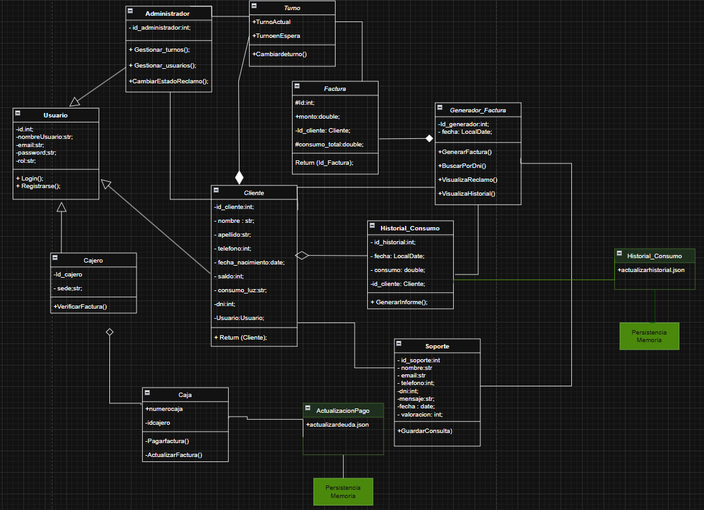

# Sistema de facturación de luz.

Este sistema modular en PHP que permite gestionar el consumo eléctrico y las cobranzas de clientes, dirigido tanto a usuarios registrados como a administradores. Incluye funcionalidades como generación de facturas, consultas de soporte, pagos y turno.

## Funcionalidades principales

* Autenticación y roles: Cliente, Cajero y Administrador, con control de acceso según su rol

* Registro e inicio de sesión de clientes.

* Generación automática de facturas.

* Gestión de pagos y actualizaciones.

* Turnos: administra atención al cliente (turno actual y en espera).

* Soporte: los clientes pueden abrir consultas y dejar valoraciones, registradas en el módulo de soporte.

* Interfaz visual clara y moderna gracias a Tailwind CSS.

## Flujo de funcionamiento

1. El cliente se registra e inicia sesión.

2. Puede consultar su factura mediante el DNI.

3. Un cajero puede registrar el pago correspondiente.

4. El cliente puede enviar consultas y calificar el soporte.

5. El administrador gestiona usuarios y turnos.

## Estructura del sistema:

**Usuario:** clase base con atributos comunes (nombre, email, contraseña, rol).

**Administrador:** gestiona usuarios y turnos.

**Caja:** gestiona los pagos de facturas.

**Cliente:** puede registrarse, loguearse y consultar su consumo.

**Factura:** contiene monto, consumo y cliente asociado.

**Soporte:** gestiona consultas del cliente y guarda valoraciones.

**Turno:** sistema básico para organizar la atención al público.

## Diagrama de clases: 

